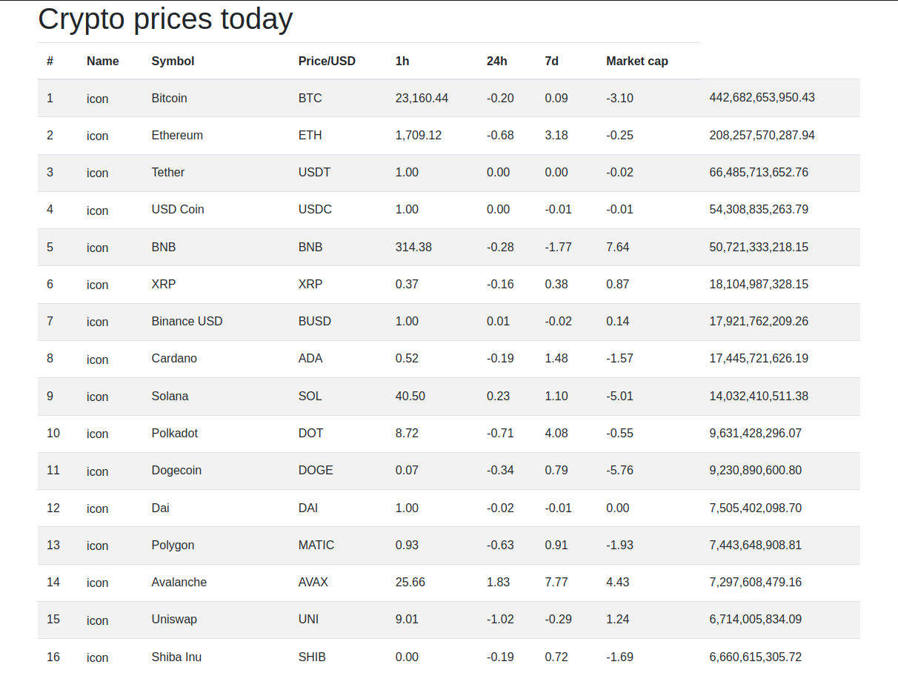

# Crypto currency TOP

Simple App for displaying top crypto currencies sorted by market cap.

### Prerequisites

The things you need before getting results:

* You need to get API key by creating  a free account in [CoinMarketCap API](https://coinmarketcap.com/api/)
* Copy your key to .env.example in place of given link
* Rename `.env.example` to `.env`

### Tech used: 

* PHP
* Bootstrap
* Twig
* phpdotenv
* nikic/fastroute
* curl

## TODO:

* Make stuff prettier (SASS, LESS or Tailwind)
* Add another API for crypto news, in a different link
* Transform to proper MVC
* . . . and more . . .

Hello World!
